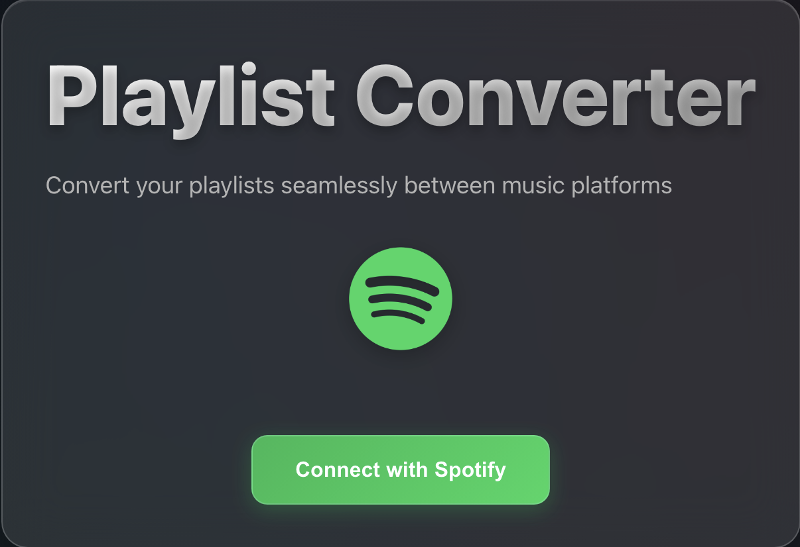
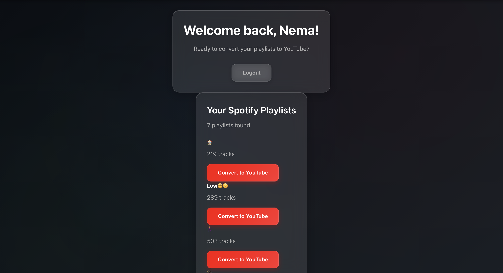
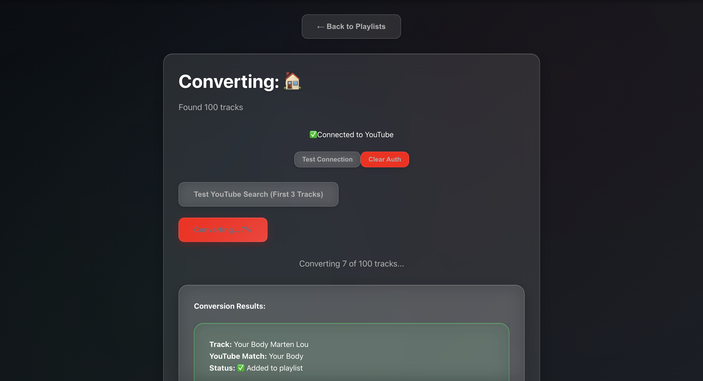

# Spotify → YouTube Playlist Converter

A modern React web app to seamlessly convert your Spotify playlists to YouTube, featuring a beautiful glassmorphism UI, dual OAuth authentication, and real-time progress tracking.

## ✨ Features

- **Modern glassmorphism UI** with dark theme and smooth animations
- **Dual OAuth 2.0 authentication** (Spotify PKCE + YouTube)
- **Automated playlist conversion** from Spotify to YouTube
- **Intelligent track matching** using YouTube search
- **Real-time progress tracking** and detailed conversion results
- **Comprehensive error handling** and token refresh
- **Responsive design** for desktop and mobile

## 🛠️ Tech Stack

- **Frontend:** React 19, Vite, React Router
- **APIs:** Spotify Web API, YouTube Data API v3
- **Auth:** OAuth 2.0 (PKCE for Spotify, standard for YouTube)
- **Styling:** Custom CSS (glassmorphism, dark mode)

## ⚡ Getting Started

1. **Clone the repo:**
   ```bash
   git clone https://github.com/nemaansari/playlist-converter.git
   cd playlist-converter/playlist-converter
   ```
2. **Install dependencies:**
   ```bash
   npm install
   ```
3. **Configure environment variables:**
   - Copy `.env.example` to `.env` and fill in your Spotify and YouTube API credentials.
4. **Run the app locally:**
   ```bash
   npm run dev
   ```
5. **Open in browser:**
   - Visit [http://localhost:5173](http://localhost:5173)

## 📝 Usage

1. **Login with Spotify** to authorize playlist access
2. **Login with YouTube** to enable playlist creation
3. **Select a Spotify playlist** and click "Convert to YouTube"
4. **Track conversion progress** and view your new YouTube playlist

## 📸 Screenshots

### Login Page


### Dashboard


### Conversion in Progress


## 🧑‍💻 Author

- [Nema Ansari](https://github.com/nemaansari)

## 📄 License

MIT
